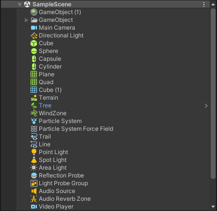

# Simple Hierarchy

## Features
- Replace some default icons with component icons in Unity hierarchy window.

## Limitations
- Not configurable(for now), icons are chosen by internal priority
- Maybe not compatible with other enhance hierarchy packages，but it's compatible with [vHierarchy 2](https://assetstore.unity.com/packages/tools/utilities/vhierarchy-2-253397) in someway.

## Install
- Open package manager window by menu `Window > Package Manager`
- Click `+` button on the top left in package manager window, select `Add package from git URL...`
- Input `https://github.com/allenz8512/SimpleHierarchy.git` in the pop-up window, and then click `Add`

## Compatibility
- Unity 2021.3 or later

## Version
- 1.2.0